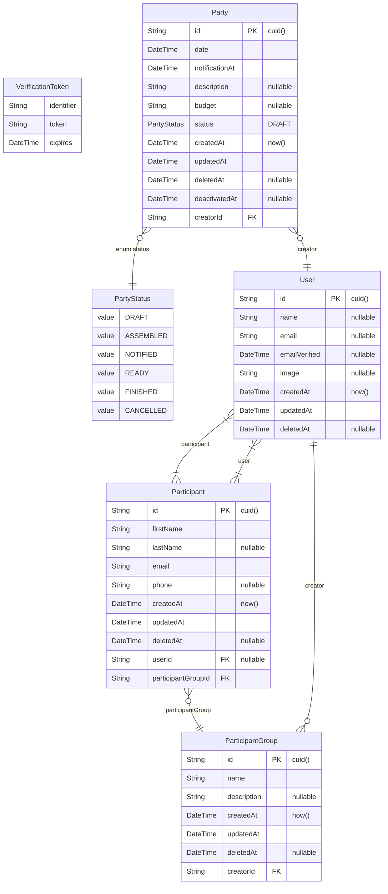

```mermaid
erDiagram
	PartyStatus {
		value DRAFT
		value ASSEMBLED
		value NOTIFIED
		value READY
		value FINISHED
		value CANCELLED
	}
	User {
		String id PK  "cuid()"
		String name  "nullable"
		String email  "nullable"
		DateTime emailVerified  "nullable"
		String image  "nullable"
		DateTime createdAt  "now()"
		DateTime updatedAt
		DateTime deletedAt  "nullable"
	}
	VerificationToken {
		String identifier
		String token
		DateTime expires
	}
	Party {
		String id PK  "cuid()"
		DateTime date
		DateTime notificationAt
		String description  "nullable"
		String budget  "nullable"
		PartyStatus status "DRAFT"
		DateTime createdAt  "now()"
		DateTime updatedAt
		DateTime deletedAt  "nullable"
		DateTime deactivatedAt  "nullable"
		String creatorId FK
	}
	Participant {
		String id PK  "cuid()"
		String firstName
		String lastName  "nullable"
		String email
		String phone  "nullable"
		DateTime createdAt  "now()"
		DateTime updatedAt
		DateTime deletedAt  "nullable"
		String userId FK  "nullable"
		String participantGroupId FK
	}
	ParticipantGroup {
		String id PK  "cuid()"
		String name
		String description  "nullable"
		DateTime createdAt  "now()"
		DateTime updatedAt
		DateTime deletedAt  "nullable"
		String creatorId FK
	}
	User }|--|{ Participant : participant
	Party }o--|| User : creator
	Party }o--|| PartyStatus : "enum:status"
	Participant }|--|{ User : user
	Participant }o--|| ParticipantGroup : participantGroup
	ParticipantGroup }o--|| User : creator

```
